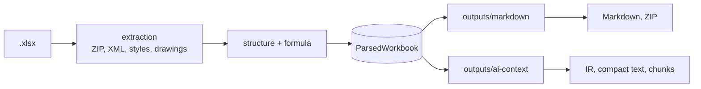

# Architecture

One parse produces one `ParsedWorkbook`. Each output reads that `ParsedWorkbook`.

## Data flow

```mermaid
flowchart LR
    xlsx[".xlsx"] --> extraction["extraction<br>ZIP, XML, styles, drawings"]
    extraction --> sf["structure + formula"]
    sf --> pw[("ParsedWorkbook")]
    pw --> md["outputs/markdown"]
    pw --> ai["outputs/ai-context"]
    md --> mdOut["Markdown, ZIP"]
    ai --> aiOut["IR, compact text, chunks"]
```
